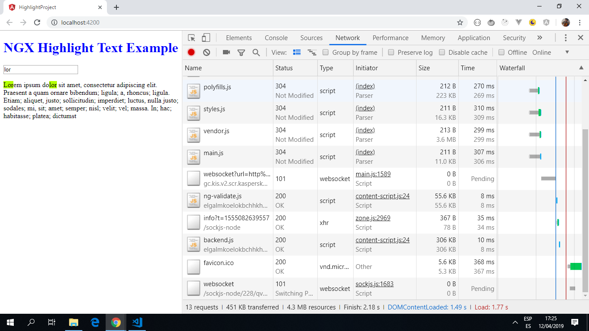

# Angular Regex Project

This app highlights search text within a string. It renders HTML on the screen via a variable and manipulates that HTML based on a query, a regular expression and regex replace logic.

*** Note: to open web links in a new window use: _ctrl+click on link_**

## Table of contents

* [General info](#general-info)
* [Screenshots](#screenshots)
* [Technologies](#technologies)
* [Setup](#setup)
* [Features](#features)
* [Status](#status)
* [Inspiration](#inspiration)
* [Contact](#contact)

## General info

* A regular expression is "A sequence of characters that forms a search pattern, mainly for use in pattern-matching with strings, or string matching, i.e. “find and replace”-like operations."

## Screenshots

.

## Technologies

* [Angular v7.0.0](https://angular.io/) & [Angular CLI v7.3.8](https://cli.angular.io/).

* [RxJS Library v6.4.0](https://angular.io/guide/rx-library) used to handle datastreams and propagation of change using observables.

## Setup

Run `ng serve` for a dev server. Navigate to `http://localhost:4200/`. The app will automatically reload if you change any of the source files.

## Code Examples

* app.component.ts file

```typescript
import { Component } from '@angular/core';

@Component({
  selector: 'app-root',
  templateUrl: './app.component.html',
  styleUrls: ['./app.component.css']
})
export class AppComponent {

  private content: string;
  public query: string;

  public constructor() {
  // tslint:disable-next-line: max-line-length
    this.content = 'Lorem ipsum dolor sit amet, consectetur adipiscing elit. Praesent a quam ornare bibendum; ligula; a, rhoncus; ligula. Etiam; aliquet, justo; sollicitudin; imperdiet; luctus, nulla justo; sodales; mi, sit; amet; semper; nisl; velit; vel; massa. In; hac; habitasse; platea; dictumst';
  }

  // if no text in query then just return
  public highlight() {
    if (!this.query) {
      return this.content;
    }
    /*The regular expression looks for all case insensitive occurrences of this.query.
    Take the matches and wrap them in HTML tags with the CSS class name that we created.*/
    return this.content.replace(new RegExp(this.query, 'gi'), match => {
      return '<span class="highlightText">' + match + '</span>';
    });
  }
}

```

## Features

* text that matches what is being searched for is highlighted. THe query is case-insensitive.

## Status & To-Do List

* Status: Tested and 100% working.

* To-Do: This could be used as a sand-box to try out other angular functionality. Regex could be expanded to search for numbers and highlight them in a different colour etc.

## Inspiration

* [link to: "Highlight Text Within a String Using Angular and Regular Expressions", by Nic Raboy of X-Team.com](https://developer.telerik.com/topics/web-development/highlight-text-within-string-using-angular-regular-expressions/).

## Contact

Created by [ABateman](https://www.andrewbateman.org) - feel free to contact me!
